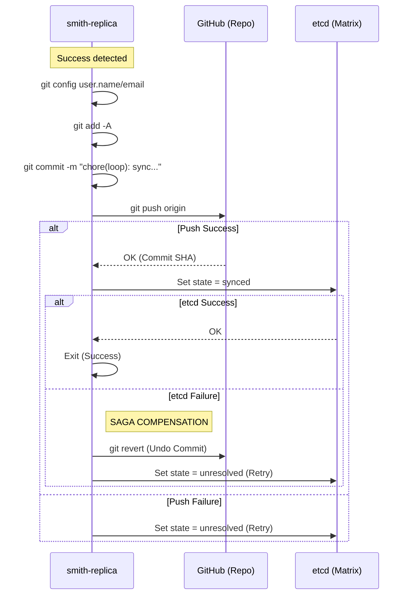

# Completion Commit Protocol (Saga)

## Goal

Prevent split-brain terminal outcomes between the code repository (Git) and the orchestration state (etcd). Smith ensures that no loop is marked as `synced` unless its changes have been safely pushed to the remote repository.

## Sequence Diagram

## Protocol Phases

1. `prepared`: completion flow starts and is persisted.
2. `code_committed`: code push succeeded and commit SHA is persisted.
3. `state_committed`: etcd state transition to `synced` succeeded.
4. `compensation_needed`: code commit succeeded but state transition failed.
5. `compensated`: revert/compensation succeeded and loop returned to `unresolved`.

## Detailed Walkthrough

### 1. Identity & Staging
Before committing, Smith configures the local Git environment using either default values (`smith-replica`) or custom values provided via `SMITH_GIT_USER_NAME` and `SMITH_GIT_USER_EMAIL`. It then runs `git add -A` to capture all workspace changes, including implementation code and PRD updates.

### 2. Local Commit
A local commit is created with a structured message: `chore(loop): sync loop <id>`. This commit serves as the atomic package of work for the iteration.

### 3. Remote Push (Sync)
The replica pushes the commit to the remote branch. If the push fails (e.g., due to a conflict or permissions), the loop is returned to `unresolved` for a later retry by the controller.

### 4. State Finalization
Only after the push is confirmed by GitHub does Smith attempt to update the loop state in `etcd` to `synced`. This marks the anomaly as resolved in the Matrix.

### 5. Compensation (Revert)
If the code is pushed but the state update fails (e.g., etcd is down), the system enters an inconsistent state. To resolve this, the "Saga" automatically triggers a `git revert` on the remote branch. This ensures the repository matches the orchestration state, allowing the loop to be safely retried without duplicate or partial implementation.

## Execution Rules
...
- On commit/push failure:
  - loop remains non-terminal (`unresolved`)
  - outcome is retryable
- On state finalize failure after code commit:
  - protocol records `compensation_needed`
  - attempts Git revert compensation
  - if compensation succeeds: state set to `unresolved`, retryable
  - if compensation fails: outcome marked `compensation_required` and escalated

## Crash Safety

- Because every phase is persisted, restart/reconciler logic can continue from the last known phase.
- No terminal `synced` state is written unless both code and state commits succeed.
- If code commit exists without state commit, the protocol explicitly records non-terminal compensation state instead of silently terminating.
