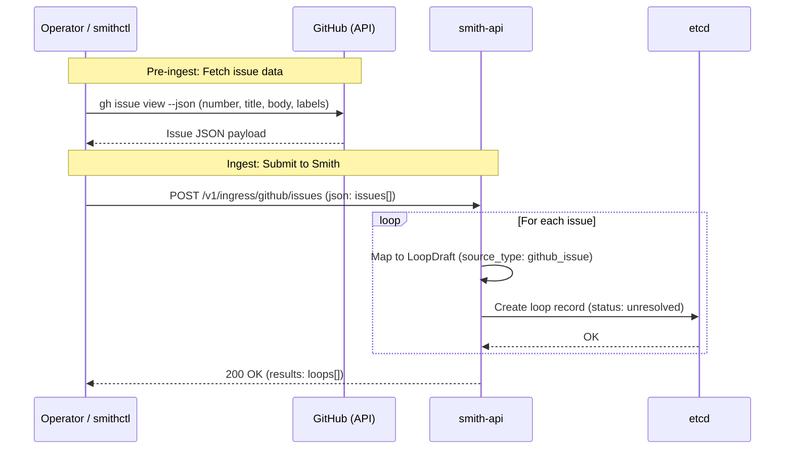
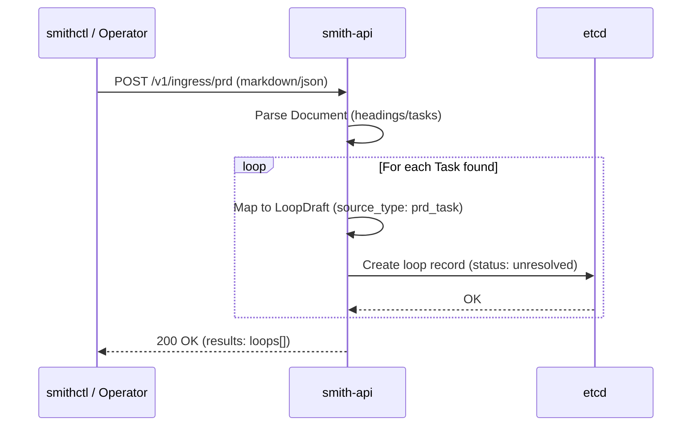
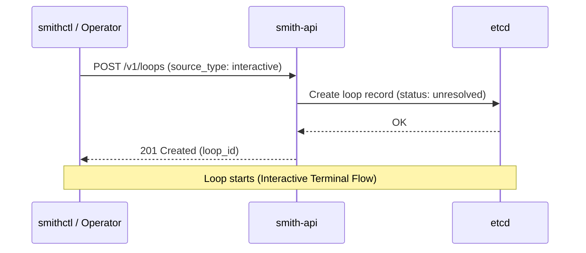
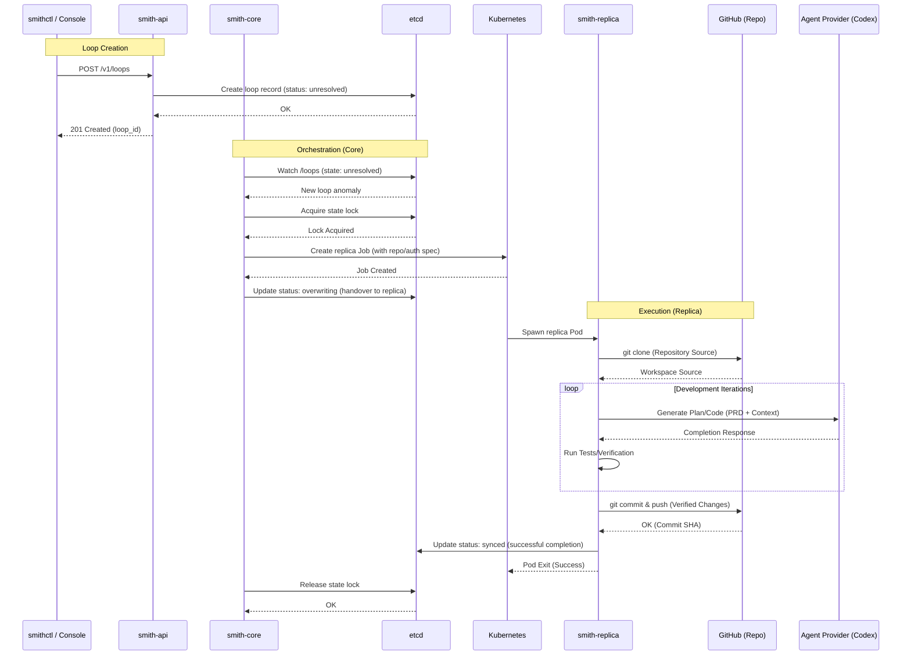
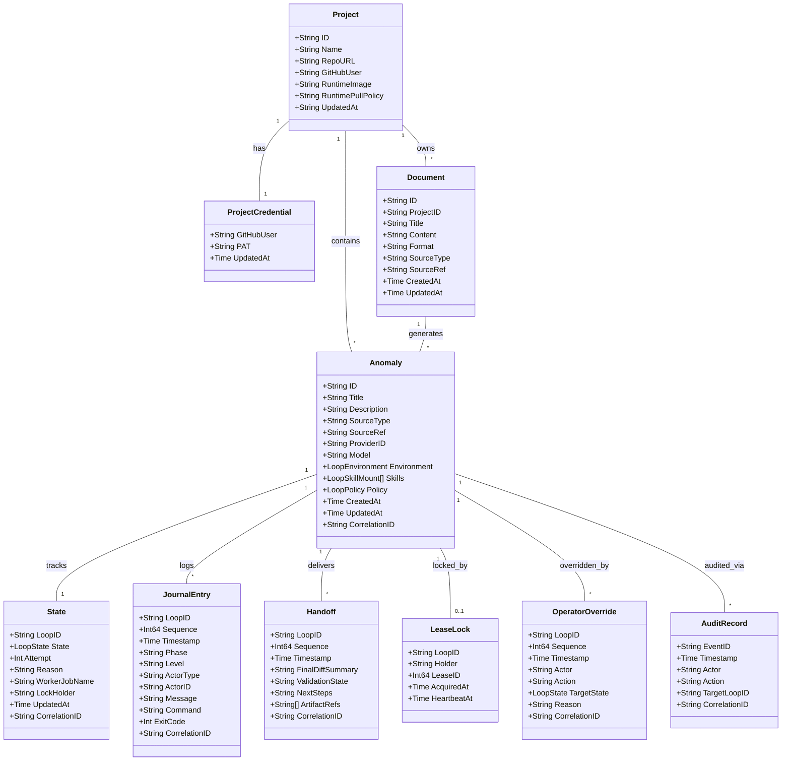
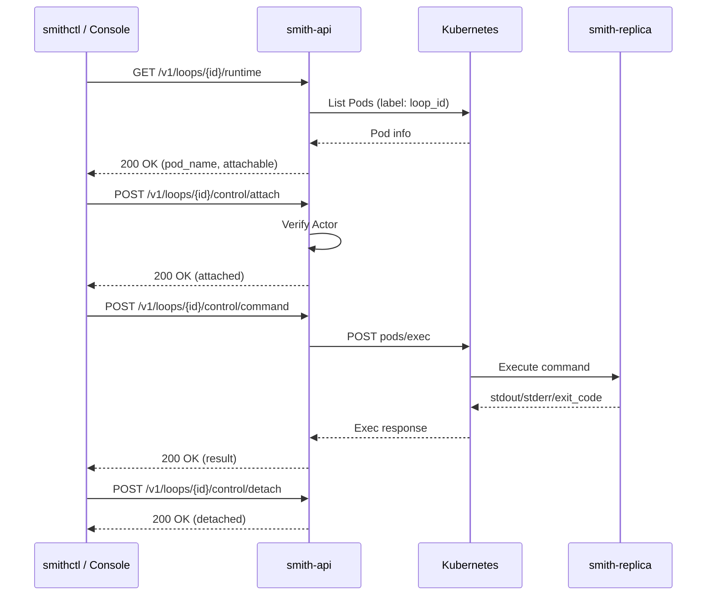

# Smith Loop Ingress and Control Surface

## Goal

Define how loops are created and controlled for single and multi-loop execution.

## Ingress Modes

### 1. GitHub Issue Ingress
- Operators can select one or more GitHub issues as loop sources.
- Smith maps each issue into an anomaly payload with source metadata.
- Batch submission supports running multiple loops in parallel.



### 2. PRD Ingress
- Operators can submit PRD documents (markdown/json) to create one or many loops.
- PRD parser extracts tasks/scopes and emits loop specs.
- Generated anomalies retain traceability to source PRD and section IDs.



### 3. Direct Interactive Ingress
- Operator starts a loop and attaches an interactive terminal session.
- Session supports live command/control, journal view, and manual interventions.
- Session events are fully journaled.



## Control Plane API (Proposed)

### Loop Lifecycle Flow



- `POST /v1/loops` create a single loop
- `POST /v1/loops/batch` create multiple loops atomically by request
- `GET /v1/loops/{id}` loop status/details
- `GET /v1/loops/{id}/journal/stream` live journal stream
- `POST /v1/loops/{id}/control/attach` attach interactive terminal session
- `POST /v1/loops/{id}/control/command` issue interactive terminal command (attach required)
- `POST /v1/loops/{id}/control/detach` detach interactive terminal session
- `POST /v1/ingress/github/issues` ingest one or more GitHub issues
- `POST /v1/ingress/prd` ingest PRD and emit loop specs

## smithctl (kubectl-style UX)

CLI should be resource-oriented and scriptable.

Example command surface:
- `smith loop create -f loop.yaml`
- `smith loop create --from-github 123`
- `smith loop create --from-prd docs/prd1.md`
- `smith loop create --batch issues.yaml`
- `smithctl loop create ... --env-preset standard`
- `smithctl loop create ... --env-image-ref ghcr.io/acme/replica:v2 --env-image-pull-policy Always`
- `smithctl loop create ... --env-docker-context . --env-dockerfile Dockerfile --env-build-arg GO_VERSION=1.22`
- `smith loop get <id>`
- `smith loop logs <id> --follow`
- `smith loop attach <id>`
- `smith loop command <id> --command "pause|resume|..."` (attach required)
- `smith loop detach <id>`
- `smith loop cancel <id>`
- `smith prd create <name> --template <tpl>`
- `smith prd submit <file>`

## Go Client Library

The Smith API can be consumed via a typed Go client library located in `pkg/client/v1`.

### Usage

```go
import (
    "context"
    client "smith/pkg/client/v1"
    api "smith/pkg/api/v1"
)

func main() {
    c := client.NewClient("http://localhost:8080", "your-token")
    
    // Create a loop
    res, err := c.CreateLoop(context.Background(), api.LoopCreateRequest{
        Title: "My New Loop",
        SourceType: "manual",
        SourceRef: "ref-1",
    })
    
    // List loops
    loops, err := c.ListLoops(context.Background())
    
    // Get loop details (typed response)
    loop, err := c.GetLoop(context.Background(), "loop-123")
    fmt.Printf("State: %s\n", loop.State.State)
}
```

### Interface

The client implements the `client.Interface` for easy mocking in tests.

```go
type Interface interface {
    CreateLoop(ctx context.Background(), req api.LoopCreateRequest) (*api.LoopCreateResult, error)
    GetLoop(ctx context.Background(), loopID string) (*api.LoopResponse, error)
    ListLoops(ctx context.Background()) ([]api.LoopWithRevision, error)
    // ... and more
}
```

## Data Model

Smith uses a highly consistent data model stored in etcd (for ephemeral orchestration state) and Kubernetes ConfigMaps (for long-lived project configuration).



## MVP Decisions

- MVP supports all three ingress modes (GitHub issues, PRDs, direct interactive).
- `smithctl` is the primary operator path for automation and terminal workflows.
- Operator Console remains the visual control/monitoring layer.

## Security and Audit

- All ingress actions require authenticated identity and are RBAC-checked.
- Every loop creation/update/control action is journaled with actor + source metadata.
- Interactive terminal sessions record attach/detach/control events.

## Non-Goals (MVP)

- Free-form plugin ingress from arbitrary third-party trackers.
- Full bidirectional sync engines for every external system.


## Implemented API Surface (Current)

### Single Loop Create

`POST /v1/loops`

Payload (single):

```json
{
  "idempotency_key": "issue-123",
  "title": "Fix flaky lock renewal",
  "description": "Investigate and patch lock renewal race",
  "source_type": "github_issue",
  "source_ref": "org/repo#123",
  "provider_id": "codex",
  "model": "gpt-5-codex",
  "metadata": {
    "priority": "p0"
  }
}
```

### Batch Loop Create

`POST /v1/loops`

Payload (batch):

```json
{
  "loops": [
    {
      "idempotency_key": "issue-124",
      "title": "Task A",
      "description": "...",
      "source_type": "github_issue",
      "source_ref": "org/repo#124"
    },
    {
      "idempotency_key": "issue-125",
      "title": "Task B",
      "description": "...",
      "source_type": "github_issue",
      "source_ref": "org/repo#125"
    }
  ]
}
```

### Idempotency and Response Semantics

- `idempotency_key` is persisted in anomaly metadata.
- Loop ID is derived deterministically from idempotency key/source when `loop_id` is not supplied.
- Repeated submissions return existing loop with `created=false`.
- Batch responses return per-item status in `results[]`.

## Console Terminal Control API Contract

The interactive terminal flow used by the pods page and pod detail view is:
`GET runtime` -> `POST attach` -> `POST command` (repeat) -> `POST detach`.

### Interactive Terminal Flow



### Runtime Target Resolution

`GET /v1/loops/{id}/runtime`

Response:

```json
{
  "loop_id": "loop-alpha",
  "namespace": "smith-system",
  "pod_name": "smith-replica-loop-alpha-12345-abc",
  "container_name": "replica",
  "pod_phase": "Running",
  "attachable": true,
  "reason": ""
}
```

When not attachable, `attachable=false` and `reason` is populated (for example `loop not active`, `runtime pod not found`, or `runtime pod not running`).

### Attach

`POST /v1/loops/{id}/control/attach`

Request:

```json
{
  "actor": "alice",
  "terminal": "console-pods"
}
```

Success response:

```json
{
  "loop_id": "loop-alpha",
  "status": "attached",
  "actor": "alice",
  "attach_count": 1,
  "active_attach_count": 1,
  "runtime_target_ref": "smith-system/smith-replica-loop-alpha-12345-abc:replica"
}
```

### Command

`POST /v1/loops/{id}/control/command`

Request:

```json
{
  "actor": "alice",
  "command": "echo ok"
}
```

Success response:

```json
{
  "loop_id": "loop-alpha",
  "status": "completed",
  "actor": "alice",
  "command": "echo ok",
  "delivered": true,
  "result": "success",
  "exit_code": 0,
  "stdout": "ok\n",
  "stderr": "",
  "runtime_target_ref": "smith-system/smith-replica-loop-alpha-12345-abc:replica"
}
```

`result` is `success`, `failed`, or `error`:
- `success`: command exited with `0`.
- `failed`: command executed and returned non-zero exit code.
- `error`: runtime exec transport failed; response includes `error` and `exit_code=-1`.

### Detach

`POST /v1/loops/{id}/control/detach`

Request:

```json
{
  "actor": "alice"
}
```

Success response:

```json
{
  "loop_id": "loop-alpha",
  "status": "detached",
  "actor": "alice",
  "attach_count": 1,
  "active_attach_count": 0,
  "runtime_target_ref": "smith-system/smith-replica-loop-alpha-12345-abc:replica"
}
```

### Error Codes and Limits

- `terminal_unauthorized` (`401`): missing/invalid bearer token when `SMITH_OPERATOR_TOKEN` is configured.
- `terminal_invalid_json` (`400`): command payload could not be decoded.
- `terminal_command_required` (`400`): command is empty.
- `terminal_command_too_long` (`400`): command exceeds max length (`2048`).
- `terminal_actor_not_attached` (`409`): actor has not attached for the loop.
- `terminal_command_rate_limited` (`429`): per-session command burst exceeded; `Retry-After` header is returned.
- Attach-specific non-attachable runtime errors return `409` with `error` text (for example `runtime pod not running`).

## Required Permissions

### API Authorization

- Terminal control endpoints are bearer-token protected when `SMITH_OPERATOR_TOKEN` is set.
- If `SMITH_OPERATOR_TOKEN` is empty, terminal endpoints are open within network perimeter; production should set the token.

### Kubernetes RBAC (smith-api ServiceAccount)

- `get,list` on core `pods` to resolve runtime targets.
- `create` on core subresource `pods/exec` to execute `control/command`.

## Troubleshooting

### `runtime pod not found`

- API surface: attach returns `409` with `error: runtime pod not found`.
- Console surface: attach/run controls stay disabled and pod detail message shows runtime target not attachable.
- Checks:
  - confirm loop is still in an active state (`unresolved` or `running`);
  - verify worker Job and Pod exist in the expected namespace;
  - check label `job-name=<worker job>` resolves at least one pod.

### `runtime pod not running`

- API surface: attach returns `409` with `error: runtime pod not running`.
- Console surface: pod detail message reflects the same reason until phase becomes `Running`.
- Checks:
  - `kubectl get pod <pod> -n <namespace> -o wide`;
  - inspect events for image pull, scheduling, or crash-loop failures;
  - retry attach after pod reaches `Running`.

### `actor must attach before issuing commands`

- API surface: command returns `409`.
- Console surface: command input remains disabled until attach succeeds.
- Checks:
  - attach first from the same actor identity;
  - if session expired/stale, detach then re-attach.
